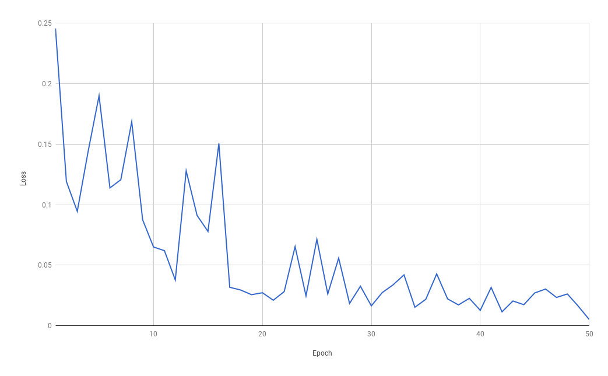
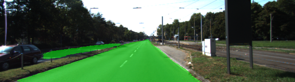
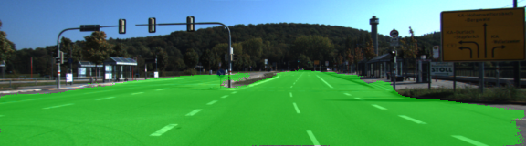
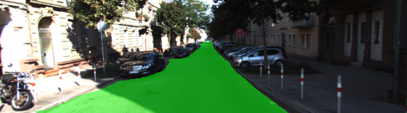
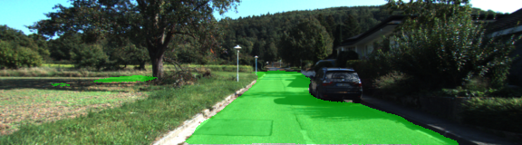
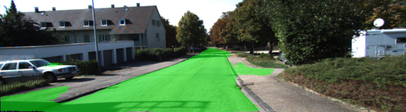
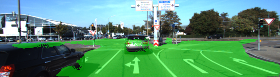
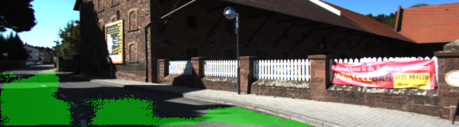

# Semantic Segmentation

### Introduction
In this project, pixels of a road in images are labeled using a Fully Convolutional Network (FCN).

### Prerequisites
 - [Python 3](https://www.python.org/)
 - [TensorFlow](https://www.tensorflow.org/)
 - [NumPy](http://www.numpy.org/)
 - [SciPy](https://www.scipy.org/)
 - [Kitti Road dataset](http://www.cvlibs.net/download.php?file=data_road.zip)
 - CUDA enabled GPU with at least 8 GB.

### Model

The network is based on fully convolutional version of `VGG16`, available [here](https://s3-us-west-1.amazonaws.com/udacity-selfdrivingcar/vgg.zip).

I have implemented code in the `main.py`, which adds fully convolutional layers and also skip connections to the `VGG16`.

The model was trained with cross entropy as loss function and with Adam optimizer.

The droput was set to 50 % and learning rate at 0.0001.

I used AWS EC2 instance g3.4xlarge with 8 GB of GPU memory to train the model, this determined the batch size to 6.

The best results were achieved after 100 epochs. 

Unfortunately, at that time I had a bug, which only printed loss once after the training. Below is a chart of loss over 50 epochs from a next attempt to see if reduced number of epochs produced same results as 100.

### Results

After 100 epochs, the resulting labels are quite smooth and there is almost no noise present. Absolute majority of images is correctly classified. I was surprised how good the network performs.

##### Example of successful cases:

Catching the opposite lane.

Covering all road pixels in the intersection.

Excluding the parked cars.

##### Problematic cases:

False positive under tree.

Spilling over to sidewalks.

Noise around cars.

Shadows can confuse the model.

### Next steps

1. data augmentation - brightness, translation, etc.
2. inference - could the model be run on my laptop's GPU?
3. Cityscapes dataset with multiclass labels